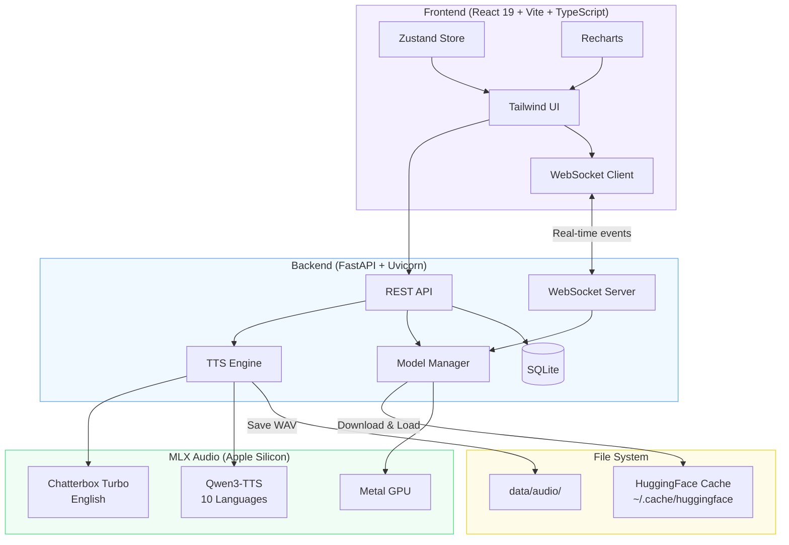
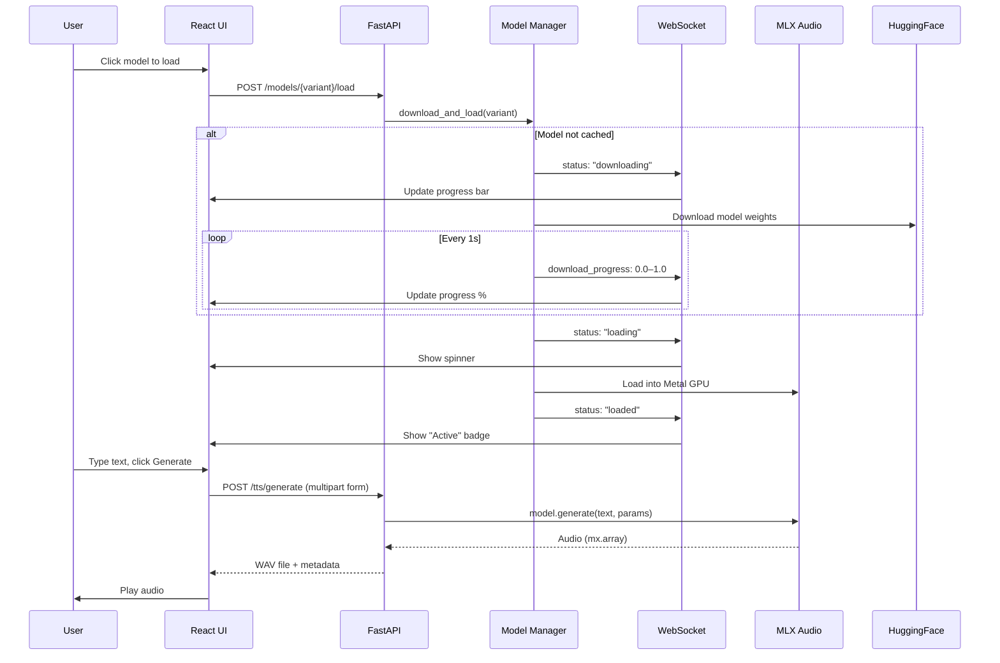

# Loqui TTS

Beautiful local text-to-speech powered by [MLX Audio](https://github.com/Blaizzy/mlx-audio) on Apple Silicon.


---

## Quick Start

```bash
git clone https://github.com/rumiallbert/loqui-tts.git
cd loqui-tts
./setup.sh
```

That's it. The script will:

1. Install [uv](https://docs.astral.sh/uv/) (fast Python package manager) if needed
2. Create a Python 3.11 virtual environment
3. Install all dependencies
4. Start the server and open your browser

Select a model from the UI to download and load it. Models are cached after the first download.

> **Requirements:** macOS with Apple Silicon (M1/M2/M3/M4). No CUDA or CPU fallback needed — everything runs natively on the Metal GPU.

### Already set up?

```bash
./start.sh
```

Skips setup and goes straight to launching.

---

## Features

- **5 Model Variants** — 3 English (Chatterbox Turbo) + 2 Multilingual (Qwen3-TTS, 10 languages)
- **Voice Cloning** — Upload a reference audio to clone any voice
- **In-Browser Downloads** — Models download with a live progress bar, no terminal interaction needed
- **Generation History** — Every generation saved with playback and metadata
- **Live System Stats** — CPU, memory, GPU, Metal usage with interactive charts
- **Real-Time Progress** — WebSocket-powered model download and status updates
- **Graceful Shutdown** — Clean model unloading from the UI or Ctrl+C

---

## Architecture



### Request Flow



---

## Models

| Variant | Engine | Size | Languages | Use Case |
|---------|--------|------|-----------|----------|
| **Turbo FP16** | Chatterbox | ~4 GB | English | Best English quality |
| **Turbo 8-bit** | Chatterbox | ~2 GB | English | Good quality, less memory |
| **Turbo 4-bit** | Chatterbox | ~1 GB | English | Fastest, smallest footprint |
| **Qwen3 0.6B** | Qwen3-TTS | ~1.2 GB | 10 languages | Fast multilingual |
| **Qwen3 1.7B** | Qwen3-TTS | ~3.4 GB | 10 languages | Best multilingual quality |

**Qwen3-TTS Languages:** English, Chinese, Japanese, Korean, French, German, Spanish, Italian, Russian, Portuguese

Only one model is loaded into memory at a time. Switching models automatically unloads the previous one to free GPU memory.

---

## API Reference

Base URL: `http://localhost:8000/api`

Interactive docs available at [http://localhost:8000/docs](http://localhost:8000/docs) when running.

### Models

| Method | Path | Description |
|--------|------|-------------|
| `GET` | `/models/` | List all model statuses |
| `GET` | `/models/device` | Device info (chip, GPU, memory) |
| `POST` | `/models/{variant}/load` | Download (if needed) and load a model |
| `POST` | `/models/shutdown` | Gracefully shut down the server |

### TTS

| Method | Path | Description |
|--------|------|-------------|
| `POST` | `/tts/generate` | Generate speech (multipart form) |

**Generate parameters:**

| Field | Type | Default | Description |
|-------|------|---------|-------------|
| `text` | string | *required* | Text to synthesize |
| `variant` | string | `turbo-4bit` | Model variant to use |
| `language` | string | `en` | Language code (Qwen models) |
| `temperature` | float | `0.8` | Sampling temperature |
| `speed` | float | `1.0` | Speech speed, 0.5–2.0 (Qwen models) |
| `reference_audio` | file | *optional* | WAV file for voice cloning |
| `ref_text` | string | *optional* | Transcript of reference audio |

### History

| Method | Path | Description |
|--------|------|-------------|
| `GET` | `/history/` | List generations (params: `limit`, `offset`) |
| `DELETE` | `/history/{id}` | Delete a single entry |
| `DELETE` | `/history/` | Clear all history |

### System

| Method | Path | Description |
|--------|------|-------------|
| `GET` | `/system/info` | CPU, memory, GPU, disk, software versions |

### Audio & WebSocket

| Method | Path | Description |
|--------|------|-------------|
| `GET` | `/audio/{filename}` | Serve a generated WAV file |
| `WS` | `/ws` | Real-time model status and download progress |

**WebSocket events:**

```jsonc
// Model status change
{"event": "model_status", "variant": "turbo-4bit", "status": "loaded"}

// Download progress (0.0 → 1.0)
{"event": "download_progress", "variant": "turbo-4bit", "progress": 0.73}
```

---

## Tech Stack

| Layer | Technology |
|-------|-----------|
| **Runtime** | Apple Silicon Metal GPU via [MLX](https://github.com/ml-explore/mlx) |
| **TTS Models** | [mlx-audio](https://github.com/Blaizzy/mlx-audio) (Chatterbox Turbo + Qwen3-TTS) |
| **Backend** | FastAPI + Uvicorn (async) |
| **Database** | SQLite via SQLAlchemy + aiosqlite |
| **Frontend** | React 19 + Vite + TypeScript + Tailwind CSS 3 |
| **State** | Zustand |
| **Charts** | Recharts (lazy-loaded) |
| **Audio I/O** | soundfile + numpy (no torchaudio) |
| **Package Manager** | uv |

---

## Project Structure

```
loqui-tts/
├── backend/
│   ├── api/              # REST endpoints + WebSocket
│   │   ├── audio.py      #   Audio file serving
│   │   ├── history.py    #   Generation history CRUD
│   │   ├── models.py     #   Model management + shutdown
│   │   ├── system.py     #   System info (CPU/GPU/memory)
│   │   ├── tts.py        #   Speech generation
│   │   ├── ws.py         #   WebSocket manager
│   │   └── router.py     #   Route aggregation
│   ├── db/               # SQLite database layer
│   ├── schemas/          # Pydantic response models
│   ├── services/         # Core business logic
│   │   ├── model_manager.py  # Model lifecycle (download/load/unload)
│   │   └── tts_engine.py     # Generation pipeline
│   ├── config.py         # Model repos, paths, constants
│   ├── dependencies.py   # Singleton service injection
│   └── main.py           # FastAPI app with lifespan
├── frontend/
│   └── src/
│       ├── api/          # API client functions
│       ├── components/   # React components
│       │   ├── tts/      #   Model selector, params, voice upload
│       │   ├── stats/    #   System info, charts, dashboards
│       │   ├── history/  #   History list and cards
│       │   ├── glass/    #   Glassmorphism form components
│       │   ├── audio/    #   Audio player
│       │   ├── layout/   #   Header, app shell
│       │   └── ui/       #   Tooltip, toast, infotip
│       ├── hooks/        # useModels, useWebSocket, useHistory
│       ├── stores/       # Zustand global state
│       └── types/        # TypeScript definitions
├── frontend-dist/        # Pre-built frontend (committed)
├── data/                 # Runtime data (SQLite DB + audio files)
├── ref/                  # Default reference audio
├── setup.sh              # First-run setup + launch
├── start.sh              # Quick launch (skip setup)
└── pyproject.toml        # Python project config
```

---

## Development

### Frontend dev mode

```bash
./setup.sh --dev
```

Starts the backend on `:8000` and Vite dev server on `:5173` with hot module replacement.

### Rebuild the static frontend

```bash
cd frontend && npm run build
```

The build output goes to `frontend-dist/` which is served by the FastAPI backend.

### Environment variables

| Variable | Default | Description |
|----------|---------|-------------|
| `LOQUI_HOST` | `127.0.0.1` | Server bind address |
| `LOQUI_PORT` | `8000` | Server port |
| `LOQUI_DEV_PORT` | `5173` | Vite dev server port |

### Pre-download models (optional)

```bash
source .venv/bin/activate
python -m backend.download_models turbo-4bit qwen-0.6b
```

Downloads model weights to the HuggingFace cache for offline use. Useful for CI or machines without fast internet.

---

Made with care by [Rumi](https://rumiallbert.com)
